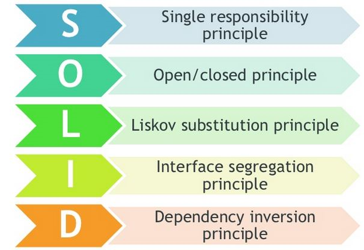

[](https://classroom.github.com/a/G0JN8jPZ)

[](https://coveralls.io/github/ULL-ESIT-INF-DSI-2324/ull-esit-inf-dsi-23-24-prct06-generics-solid-AlejandroJ22?branch=main)

# Informe práctica 6 - Clases e interfaces genéricas. Principios SOLID.



## Alejandro Javier Aguiar Pérez
> [alu0101487168@ull.edu.es](mailto:alu0101487168@ull.edu.es)

## Índice
1. [Resumen](#resumen)
2. [Ejercicios](#ejercicios)
   - [Ejercicio 1 La mudanza](#ejercicio-1-la-mudanza)
   - [Ejercicio 2 Facturas en diferentes formatos](#ejercicio-2-facturas-en-diferentes-formatos)
   - [Ejercicio 3 Gestor de ficheros](#ejercicio-3-gestor-de-ficheros)
   - [Ejercicio 4 Impresoras y escáneres](#ejercicio-4-impresoras-y-escáneres)
   - [Ejercicio 5 Servicio de mensajería](#ejercicio-5-servicio-de-mensajería)
   - [Ejercicio PE](#ejercicio-pe)
3. [Conclusiones](#conclusiones)
4. [Referencias](#referencias)

## Resumen

> **[Volver al índice](#índice)**

## Ejercicio 1 La mudanza

En primer momento pense en implementar la clase *Box()* con el patron *Singleton*, pero luego pensé que no era lo adecuado según lo requerido por el ejercicio ya que quisieramos tener varias cajas en lugar de una sola, como suele pasar con las bases de datos. Decidí implementar una **clase generica** *Houseware()* que represente un mueble cualquiera que al menos tenga un atributo que sirva como *identificador* del mueble, es decir, un *nombre*. Esto lo hice así porque si en el futuro quiero que el mueble contenga atributos como *"color"*, *"shape"*, *"value"*... Puedo implementarlo sin modificar el programa, cumpliendo con el principio de que mi programa debe estar **abierto** a nuevas funcionalidades y **cerrado** a modificaciones. El concepto de caja planteado puede contener elementos de la clase *Houseware* de cualquier tipo, para que solo tengamos que llamar a la funcion con un tipo diferente según los atributos que quieras añadir al mueble.

```ts
interface BoxInterface<T extends Houseware<any>>
```

Poco más que comentar luego de lo ya dicho, puesto que la funcionalidad de la clase *Box()* es bastante simple, al final es un *array* de elementos de la clase *Houseware*:

```ts
private housewares: T[];
```

y todos sus métodos se basan en operaciones simples con los metodos de *array.prototype*. Tambíen pensé en usar un atributo *map* en lugar del atributo *array*, pero no lo ví del todo claro y opté por el uso del *array*.

> **[Volver al índice](#índice)**

## Ejercicio 2 Facturas en diferentes formatos

Lo primero que hice fue buscar cuales eran los [elementos básicos de una factura](https://www.anfix.com/blog/como-hacer-facturas/informacion-en-facturas) y en base a ello, cree una clase abstracta:

```ts
abstract class Invoice implements InvoiceInterface {
  protected date: Date;
  protected issuer: string;
  protected receiver: string;
  protected concept: string;
  protected baseAmount: number;
  protected taxRate: number;
}
```

Que viene determinada por la siguiente interfaz:

```ts
interface InvoiceInterface {
  getTotal(): number;
  toString(): string;
}
```

Dos funciones cuya funcionalidad desarrollada en las clases hijo de esta, será la de calcular el total de la factura e imprimir la orden de factura por pantalla. Desde esta clase abstracta ya podemos crear diferentes tipos de facturas, siempre manteniendo los elementos básicos de la factura, como estamos definiendo su funcionamiento en las clases hijas, cumplimos con el principio de dependencia inversa y no nos veremos obligados a modificar la clase padre cada vez que queramos añadir un tipo de facturo, o peor aún a implementar otra clase que defina parte de la misma, añadiendo lineas de código totalmente innecesarias. Decidí usar un método

```ts
toString(): string;
```

en lugar de un método

```ts
print(): void;
```

ya que comprobar su funcionamiento posteriormente a través de test es mucho más sencillo. Por último dejo dos muestras de como sería para añadir dos facturas que actúan de manera distinta, la más básica posible, y la factura que aplica descuento:
- **Facturación Básica**

```ts
/**
 * Subclase más simple posible, no se añaden atributos.
 */
class SimpleInvoice extends Invoice {
  /**
   * Crea una instancia de factura simple.
   * @param issuer Identificación completa del emisor.
   * @param receiver Identificación del receptor.
   * @param concept Descripción del concepto.
   * @param baseAmount Base imponible sobre la que girarán los impuestos o retenciones.
   * @param taxRate Tasa aplicada.
   */
  constructor(
    issuer: string,
    receiver: string,
    concept: string,
    baseAmount: number,
    taxRate: number,
  ) {
    super(issuer, receiver, concept, baseAmount, taxRate);
  }

  /**
   * Implementación del método para calcular el total de la factura según la tasa aplicada.
   * @returns Total de la factura.
   */
  getTotal(): number {
    const taxAmount = this.baseAmount * (this.taxRate / 100);
    return this.baseAmount + taxAmount;
  }

  /**
   * Implementación del método para obtener la representación de la factura con descuento en forma de texto.
   * @returns Representación en texto de la factura con descuento.
   */
  toString(): string {
    return `
            FACTURA
            Fecha: ${this.date.toLocaleDateString()}
            Emisor: ${this.issuer}
            Receptor: ${this.receiver}
            Concepto: ${this.concept}
            Base Imponible: ${this.baseAmount.toFixed(2)}€
            Tasa aplicada: ${this.taxRate}%
            Total: ${this.getTotal().toFixed(2)}€
        `;
  }
}
```

- **Facturación con Descuento**:

```ts
/**
 * Subclase con un atributo descuento.
 */
export class DiscountedInvoice extends Invoice {
  private discount: number;

  /**
   * Crea una instancia de factura con descuento.
   * @param issuer Identificación completa del emisor.
   * @param receiver Identificación del receptor.
   * @param concept Descripción del concepto.
   * @param baseAmount Base imponible sobre la que girarán los impuestos o retenciones.
   * @param taxRate Tipo de IVA aplicado.
   * @param discount Porcentaje de descuento aplicado.
   */
  constructor(
    issuer: string,
    receiver: string,
    concept: string,
    baseAmount: number,
    taxRate: number,
    discount: number,
  ) {
    super(issuer, receiver, concept, baseAmount, taxRate);
    this.discount = discount;
  }

  /**
   * Implementación del método para calcular el total de la factura con descuento.
   * @returns Total de la factura con descuento.
   */
  getTotal(): number {
    const taxAmount = this.baseAmount * (this.taxRate / 100);
    const discountedAmount = this.baseAmount * (this.discount / 100);
    return this.baseAmount - discountedAmount + taxAmount;
  }

  /**
   * Implementación del método para obtener la representación de la factura con descuento en forma de texto.
   * @returns Representación en texto de la factura con descuento.
   */
  toString(): string {
    return `
              FACTURA CON DESCUENTO
              Fecha: ${this.date.toLocaleDateString()}
              Emisor: ${this.issuer}
              Receptor: ${this.receiver}
              Concepto: ${this.concept}
              Base Imponible: ${this.baseAmount.toFixed(2)}€
              Tasa aplicada: ${this.taxRate}%
              Descuento: ${this.discount}%
              Total: ${this.getTotal().toFixed(2)}€
          `;
  }
}
```

> **[Volver al índice](#índice)**

## Ejercicio 3 Gestor de ficheros

La respuesta a la pregunta es que no cumple con los [Principios SOLID](https://samueleresca.net/solid-principles-using-typescript/) ya que rompe el **principio de responsabilidad única** porque una misma clase se encarga de leer y de escribir un archivo, cuando debería de depender de clases hijas para implementar esos metodos, además aprovecho esto para decir que tampoco cumple con el **principio de dependencia inversa** por lo ya dicho y también rompe el **principio de segregación de la interfaz** por obvias razones. Lo que pensé en hacer para que el programa cumpla con todos los principios fue:

- Añadí una interfaz para la clase *FileManager*:

```ts

/**
 * Interfaz de un gestor de archivos.
 */
interface FileManagerInterface {
  /**
   * Lee el contenido del archivo.
   * @returns El contenido del archivo como una cadena de texto.
   */
  readFile(): string;

  /**
   * Escribe datos en el archivo.
   * @param data Los datos a escribir en el archivo.
   */
  writeFile(data: string): void;
}
```

- Cambié el atributo filePath a *protected* en lugar de *private*, para que pueda ser usado por las clases hijas.

```ts
protected filePath: string
```

- Creé tres clases hijas en las que una podía escribir en un archivo únicamente, la otra podía solo leer el archivo y la restante podía hacer ambas acciones.

```ts
class WriteableFile extends FileManager;
class ReadableFile extends FileManager;
class RootFileManager extends FileManager;
```

**Nota**: como todavía no he experimentado lo suficiente con la lectura y escritura de archivos usando **TypeScript** no se muy bien como ejecutar los tests así que hay ciertas líneas de código que en los test no alcanzan a ser comprobadas por **Coveralls**, esto solo ocurre cuando falla la lectura o escritura de un archivo. Por ello mi coverage no es del 100%.

> **[Volver al índice](#índice)**

## Ejercicio 4 Impresoras y escáneres

Creo que en este ejercicio se viola principalmente el **principio de dependencia inversa** porque las clases Printer, Scanner y PrinterScanner tienen una funcionalidad muy parecida que se lleva a cabo en tres clases totalmente diferentes, en lugar de llo, se debería crear una clase padre de la que partan estas tres subclases. También deberiamos de crear una interfaz para cada una de estas nuevas subclases y así poder seguir cumpliendo con el principio de segregación de la interfazo. Para ello se añaden tres de subclases:

- El que solo puede imprimir:

```ts
/**
 * Clase que representa un dispositivo de impresora.
 * Implementa la interfaz PrinterScanner.
 */
class Printable extends PrinterScanner {
  /**
   * Method to print.
   */
  print(): void {
    console.log("Printing...");
  }

  /**
   * Método para escanear.
   * No puede escanear.
   */
  scan(): void {
    throw new Error("Printer cannot scan.");
  }
}
```

- El que solo puede escanear:

```ts
/**
 * Clase que representa un dispositivo de escáner.
 * Implementa la interfaz PrinterScanner.
 */
class Scannable extends PrinterScanner {
  /**
   * Método para imprimir.
   * No puede imprimir.
   */
  print(): void {
    throw new Error("Scanner cannot print.");
  }

  /**
   * Método para escánear.
   */
  scan(): void {
    console.log("Scanning...");
  }
}
```

- El que hace ambas acciones:

```ts
/**
 * Clase que puede imprimir y escanear.
 */
class PrintableScannable extends PrinterScanner {
  /**
   * Método para imprimir.
   */
  print(): void {
    console.log("Printing...");
  }

  /**
   * Método para escanear.
   */
  scan(): void {
    console.log("Scanning...");
  }
}
```

Que parten de la siguiente clase abstracta e interfaz:

```ts
/**
 * Interfaz que representa un dispositivo capaz de imprimir y escanear
 */
interface PrinterScannerInterface {
  /**
   * Method to print.
   */
  print(): void;

  /**
   * Method to scan.
   */
  scan(): void;
}

/**
 * Clase abstracta que representa un dispositivo de impresora y escáner.
 * Las clases que amplían esta clase abstracta deben proporcionar implementación
 * para los métodos de impresión y escaneo.
 */
abstract class PrinterScanner implements PrinterScannerInterface {
  /**
   * Método abstracto para imprimir.
   * Las subclases deben proporcionar implementación para la impresión.
   */
  abstract print(): void;

  /**
   * Método abstracto para escanear.
   * Las subclases deben proporcionar implementación para el escaneo.
   */
  abstract scan(): void;
}
```

> **[Volver al índice](#índice)**

## Ejercicio 5 Servicio de mensajería

Lo primero es que no cumple con el principio de segregación de interfaces, ya que no hay ninguna interfaz implementada, además se puede mejorar la escalabilidad del programa si nos basamos en el principio de dependencia inversa y creamos una clase generica que use la siguiente interfaz como tipo:

```ts
/**
 * Interfaz que representa un servicio de notificación.
 */
interface NofierMessages {
  /**
   * Método para enviar una notificación.
   * @param message: el mensaje que se enviará.
   */
  notify(message: string): void;
}
```

De esta manera si queremos en un futuro añadir más tipos de notificaciones no tenemos que modificar la clase *Notifier* que ahora usa la interfaz como tipo:

```ts
class Notifier<T extends NofierMessages>;
```

Las otras dos clases simplemente implementan *NotifierMessages*.

> **[Volver al índice](#índice)**

## Ejercicio PE

El ejercicio planteado en la clase era el de crear una clase génerica *SearchableCollection* que implementase dos interfaces: *Collectable* y *Searchable*. Y la clase debia de contener objetos del tipo string o del tipo numeric, entonces lo que plantee para hacer este ejercicio fue:

- Interfaz Collectable:
Define métodos para añadir, obtener, y remover elementos de una colección, así como para obtener el número total de elementos en la colección.

- Interfaz Searchable:
Extiende la interfaz Collectable y agrega un método search que permite buscar elementos dentro de la colección.

- Clase abstracta SearchableCollection:
Es la clase padre del programa, contiene un array de obejetos de **tipo génerico** y define todos los métodos de la interfaz *Collectable* que no necesitan de ninguna distinción entre tipos para poder funcionar, son métodos que funcionan para cualquier tipo básciamente. Y declara como **abstracto** el método *search* ya que es diferente buscar una variable *number* a una variable *string*.

- Clases NumericSearchableCollection y StringSearchableCollection:
Extienden *SearchableCollection* y proporcionan implementaciones específicas de los métodos de búsqueda para números y cadenas, respectivamente. *StringSearchableCollection* no hace distinción entre mayúsculas y minúsculas.

## Conclusiones

Esta práctica me ha servido para poder seguir mejorando en el planteamiento de clases, clases abstractas y genéricas. Durante esta práctica, he aprendido que la aplicación de los principios SOLID puede conducir a un código más limpio, modular y fácil de mantener. También he visto cómo la adhesión a estos principios puede mejorar la escalabilidad de un sistema a lo largo del tiempo. La utilización de herramientas de análisis de cobertura como Coveralls no sólo es útil para evaluar la calidad del código, sino que también proporciona una visión general de la efectividad de las pruebas unitarias, el número de líneas sin revisar en los tests.

## Referencias

[Principios SOLID](https://samueleresca.net/solid-principles-using-typescript/)
[Coveralls](https://coveralls.io/repos/new)
[Elementos Básicos Facturas](https://www.anfix.com/blog/como-hacer-facturas/informacion-en-facturas)